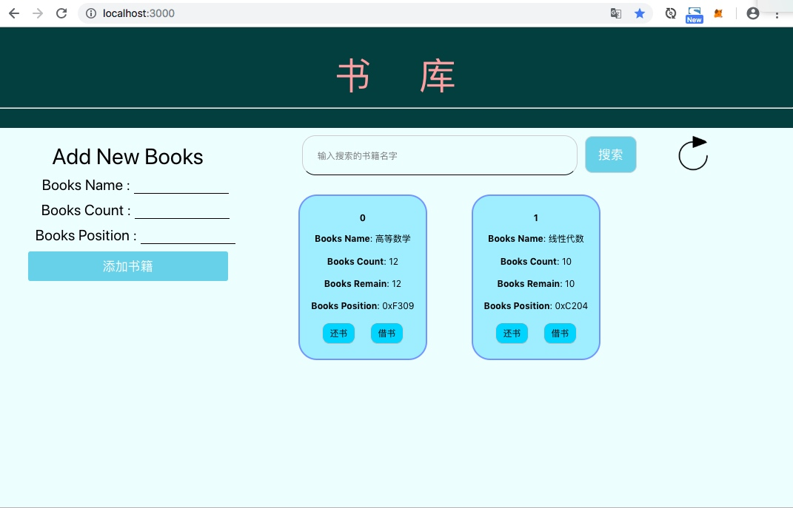
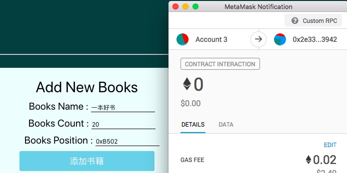
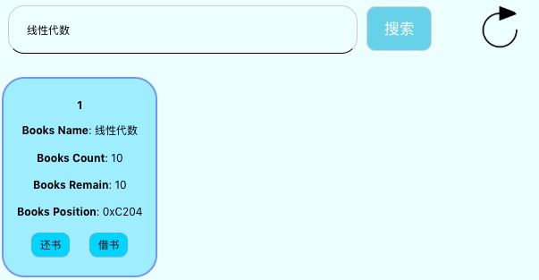
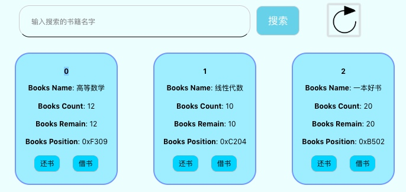
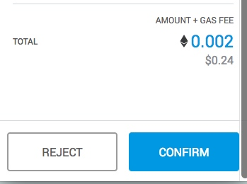
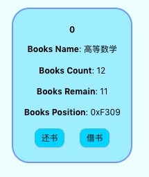

## 区块链报告

* 选题背景、依据

    * 一个图书书库借阅系统，主要是考虑到书籍的更加的安全和可靠性，所以就考虑制作这个题目，可以把书籍的数据都存储在链上，从而能防止一些乱七八糟的错误更改，更加的健全这个系统，减少一些问题。 

* 使用说明(应有截图与说明) 

    * 首先在Demo2的目录下： truffle develop  打开测试环境 
    * 接着 complie 和 migrate --reset ，把合约部署上去 
    * 使用那个狐狸连接到测试环境，并创建一个测试账号 
 
    * 在client目录下，开启前端： npm run dev  
    * 基本上就可以使用了 

    * 大致的界面如下： 

    * 界面功能不多，主要是简单的借阅和归还的功能，基本满足了一个书库系统所需的功能。 

* 测试

    * 添加书籍，输入name，count（设置了输入限制，只能是数字），position，点击添加。 
    
    * 成功添加 
    
    * 搜索书籍：线性代数 
    
    * 刷新按钮：获取链上最新的书籍信息 
    
    * 借书按钮，首先会确认是否有书可借，同样要确认gas交易，并且书籍慎于数减1 
    
    
    * 还书按钮，首先会检测书籍是否还完，然后再gas交易，书籍数目加1 
    
    * 大致功能如上，下面是交易确认的记录 
    

    

